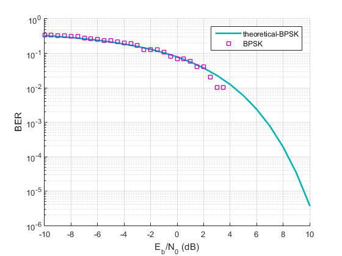
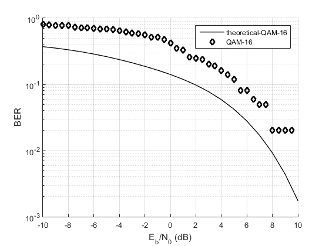
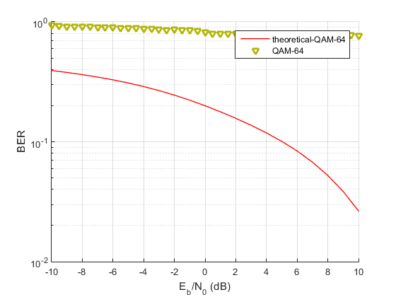

# Digital Communciation Project

   This is a simulation of the performance of different modulation schemes including [BPSK][df1]> , [QPSK][df1], [FSK][df1],  [QAM-16][df1] and [QAM-64][df1] in an AWGN environment with different signal to ratio values.
#### To run the simulation:

1. write the command bertool in the command window.
2. set Eb/N0 -10:1:10 in theoritcal and monte carlo tabs.
3. browse and choose the desireds model.slx.
4. set Ber variable Name = ber.
5. Press plot in theoritcal and run in monte carlo.

### general parameters

#### Random Integer Generator
```sh
Samples per frames =  100
Sample Time = 1
```
#### AWGN channel 
```sh
intial seed  = 67
```

### Binary Phase Shift Keying (BPSK)
---------------------
##### description
&nbsp;
Binary Phase Shift Keying (BPSK) is a two phase modulation scheme, where the 0’s and 1’s in a binary message are represented by two different phase states in the carrier signal: θ=0∘ for binary 1 and θ=180∘ for binary 0.


##### Paramters
```sh
Random Integer Generator M-ary number = 2
```

##### Performance

##### Schematic

##### Before Noise Scatter plot

##### After Noise Scatter plot


### Quadrature Phase Shift Keying (QPSK)
-------
##### description

Quadrature Phase Shift Keying (QPSK) is a form of Phase Shift Keying in which two bits are modulated at once, selecting one of four possible carrier phase shifts (0, 90, 180, or 270 degrees). QPSK allows the signal to carry twice as much information as ordinary PSK using the same bandwidth.
##### Paramters
```sh
Random Integer Generator M-ary number = 4
modulator and demodulator phase shift = pi/2
```

##### Performance

##### Schematic

##### Before Noise Scatter plot

##### After Noise Scatter plot


### Quadrature amplitude modulation (QAM16)
----------------------
##### description
Quadrature amplitude modulation (QAM) conveys two analog message signals, or two digital bit streams, by changing (modulating) the amplitudes of two carrier waves, using the amplitude-shift keying (ASK) digital modulation scheme or amplitude modulation (AM) analog modulation scheme. The two carrier waves of the same frequency are out of phase with each other by 90°, a condition known as orthogonality and as quadrature. Being the same frequency, the modulated carriers add together, but can be coherently separated (demodulated) because of their orthogonality property. Another key property is that the modulations are low-frequency/low-bandwidth waveforms compared to the carrier frequency, which is known as the narrowband assumption. 
In digital QAM, the number of modulation states determines how the digital signal is split up. For example, in 8QAM, each three bits of input alters the phase and amplitude of the carrier to derive eight unique modulation states, in this case it's four bits
##### Paramters
```sh
Random Integer Generator M-ary number = 16
modulator and demodulator phase shift = 0
modulator and demodulato M-ary number = 16
modulator and demodulator average power referenced to 1 ohm (watts) = 1
```

##### Performance

##### Schematic

##### Before Noise Scatter plot

##### After Noise Scatter plot


### change!!!!!!!! (QAM64)
##### description
Quadrature amplitude modulation (QAM) conveys two analog message signals, or two digital bit streams, by changing (modulating) the amplitudes of two carrier waves, using the amplitude-shift keying (ASK) digital modulation scheme or amplitude modulation (AM) analog modulation scheme. The two carrier waves of the same frequency are out of phase with each other by 90°, a condition known as orthogonality and as quadrature. Being the same frequency, the modulated carriers add together, but can be coherently separated (demodulated) because of their orthogonality property. Another key property is that the modulations are low-frequency/low-bandwidth waveforms compared to the carrier frequency, which is known as the narrowband assumption. 
In digital QAM, the number of modulation states determines how the digital signal is split up. For example, in 8QAM, each three bits of input alters the phase and amplitude of the carrier to derive eight unique modulation states, in this case it's six bits
##### Paramters
```sh
Random Integer Generator M-ary number = 64
modulator and demodulator phase shift = 0
modulator and demodulato M-ary number = 64
modulator and demodulator average power referenced to 1 ohm (watts) = 1
```

##### Performance

##### Schematic

##### Before Noise Scatter plot

##### After Noise Scatter plot


### Frequency Shift Keying (FSK)
----------
##### description
Frequency Shift Keying (FSK) is the digital modulation technique in which the frequency of the carrier signal varies according to the digital signal changes. FSK is a scheme of frequency modulation.

The output of a FSK modulated wave is high in frequency for a binary High input and is low in frequency for a binary Low input. The binary 1s and 0s are called Mark and Space frequencies.
##### Paramters
```sh
Random Integer Generator M-ary number = 8
modulator and demodulato M-ary number = 8

```

##### Performance

##### Schematic

##### Before Noise Scatter plot

##### After Noise Scatter plot


